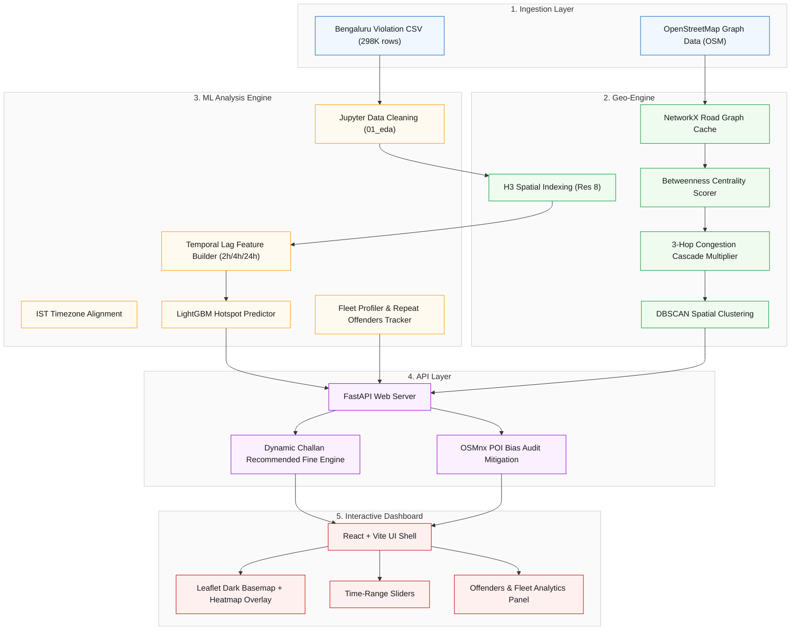

# ParkSense AI — Bengaluru Traffic Command Center

**AI-powered parking violation impact scoring engine that quantifies, predicts, and mitigates congestion caused by illegal parking.**

---

## Key Features

* **Congestion Impact Score (CIS)**: A novel 0–100 spatial-network score quantifying the true traffic cost of each violation.
* **Dynamic Challan Engine**: Progressive policy tool scaling fines proportional to congestion impact (e.g., ₹500 base scales up to ₹2,200 for critical arterial blockages).
* **Predictive ML Hotspots**: Proactive 2-hour congestion forecasting powered by a LightGBM regressor trained on 298K historical records.
* **DBSCAN Spatial Clustering**: Density-based grouping of isolated parking violations into actionable police dispatch zones.
* **Offender & Fleet Analytics**: Profiling chronic repeat offenders and commercial fleets (mapped to regional RTO fleets) with primary location tracking.
* **Sensor Health Audit**: Statistical quality grading of reporting cameras/devices per police station to isolate faulty hardware.
* **POI Bias Mitigation**: Spatial checks querying live OpenStreetMap Overpass APIs to normalize scores near high-traffic commercial zones.
* **ParkFlow What-If Simulation**: Spatial simulation modeling the traffic impact (CIS reduction and spatial overflow displacement) of placing patrols or barricades.

---

## System Architecture



---

## Core Innovations

### 1. The Congestion Impact Score (CIS)

Rather than penalizing the act of parking, we penalize the **traffic impact** of the act. The CIS is computed dynamically using:

$$
\text{CIS} = \text{Blockage Factor} \times \text{Road Criticality} \times \text{Temporal Weight} \times \text{Cascade Multiplier}
$$

* **Blockage Factor (BF)**: Footprint of the vehicle (Bus = 2.5, Car = 1.5, Scooter = 0.5).
* **Road Criticality (RC)**: Normalised Betweenness Centrality computed from the city's OpenStreetMap road graph.
* **Temporal Weight (TW)**: Rush-hour weights (1.3 during 8-10 AM & 5-8 PM local time; 1.0 otherwise).
* **Cascade Multiplier (CM)**: 3-hop BFS traffic delay spillover mapping capacity reduction to adjacent downstream segments.

### 2. Dynamic Challans

Penalties scale based on the disruption score using the following progressive formula:

$$
\text{Recommended Challan} = \text{Base Fine} \times \left(1 + \frac{\text{CIS}}{100} \times 4\right)
$$

*For example, with a base fine of ₹500, a minor scooter violation (CIS = 25) yields ₹1,000, while a bus blocking an arterial link (CIS = 85) recommends ₹2,200.*

---

## Repository Layout

```
parksense/
├── data/
│   ├── raw/                 # Gitignored raw CSV dataset
│   ├── processed/           # Scored Parquet data + Cached Graph
│   └── mock/                # 500-row developer mock CSV
├── backend/
│   ├── app/                 # FastAPI Router, Controllers, Models
│   │   ├── routes/          # Endpoints (violations, stats, predict, etc.)
│   │   └── main.py          # Fast API Shell
│   ├── engine/              # Geo-Engine (Centrality, Graph, DBSCAN)
│   ├── ml/                  # ML Engine (LGBM Forecast, Profiler, POI check)
│   ├── models/              # Serialized LGBM pickles
│   └── requirements.txt     # Python Dependencies
├── frontend/
│   ├── src/
│   │   ├── components/      # Leaflet Map, Heatmap, Chart Panels
│   │   └── App.jsx          # UI Dashboard Shell
│   └── package.json         # Node Dependencies
└── notebooks/
    └── 01_eda.ipynb         # Data preprocessing, timezone alignment, cleaning
```

---

## Tech Stack

| Layer       | Tool                                       |
| ----------- | ------------------------------------------ |
| Frontend    | React + Vite + Leaflet.js + Recharts       |
| Backend API | Python 3.11 + FastAPI + Uvicorn            |
| Geo/Graph   | OSMnx + NetworkX + Shapely + H3            |
| ML          | scikit-learn (DBSCAN) + LightGBM + Prophet |
| Data        | Pandas + SQLite + Parquet                  |
| Maps        | OpenStreetMap (free) — NO paid map APIs   |

---

## Branches

| Branch                  | Owner  | Responsibility                                        |
| ----------------------- | ------ | ----------------------------------------------------- |
| `main`                | All    | Stable integration target — no direct commits        |
| `frontend-dashboard`  | Mayank | React + Leaflet UI                                    |
| `backend-api`         | Kritik | FastAPI core + all endpoints                          |
| `backend-geo-engine`  | Aditi  | CIS scorer, graph, clustering, BPR, cascade           |
| `backend-ml-analysis` | Eric   | Forecasting, repeat offenders, sensor audit, POI bias |

---

## Quick Start

### 1. Prerequisites

Ensure you have Python 3.11+ and Node.js v18+ installed on your system.

### 2. Backend Installation & Run

```bash
cd backend
python -m venv .venv
source .venv/bin/activate       # On Windows: .venv\Scripts\activate
pip install -r requirements.txt
uvicorn app.main:app --reload
```

*API will run at `http://localhost:8000`. Interact with swagger docs at `http://localhost:8000/docs`.*

### 3. Frontend Installation & Run

```bash
cd frontend
npm install
npm run dev
```

*Dashboard will run at `http://localhost:5173`.*

---

## API Reference

### API Reference Table

| HTTP Method   | Endpoint                   | Query Parameters                                                      | Description                                         |
| :------------ | :------------------------- | :-------------------------------------------------------------------- | :-------------------------------------------------- |
| **GET** | `/`                      | None                                                                  | Returns API health status.                          |
| **GET** | `/api/violations`        | `hour_start`, `hour_end`, `vehicle_type`, `limit`, `offset` | Fetches filtered violation records.                 |
| **GET** | `/api/stats`             | None                                                                  | Computes command center KPI counters.               |
| **GET** | `/api/hotspots`          | `limit`, `min_cis`, `min_count`, `eps_meters`                 | Runs DBSCAN clustering for dispatch zones.          |
| **GET** | `/api/heatmap`           | `resolution`, `hour_start`, `hour_end`, `top_n`               | Aggregates H3 hexagon weights for rendering.        |
| **GET** | `/api/offenders`         | `limit`                                                             | Lists repeat vehicle offenders.                     |
| **GET** | `/api/fleets`            | None                                                                  | Groups anonymized prefixes to map regional fleets.  |
| **GET** | `/api/sensors/audit`     | None                                                                  | Grades reporting cameras (OK / WARNING / CRITICAL). |
| **GET** | `/api/predict`           | `resolution`, `hour`, `day_of_week`, `limit`                  | Forecasts next-2h hotspots using LightGBM.          |
| **GET** | `/api/challan/recommend` | `violation_id`, `override_base_fine`                              | Recommends dynamic challan fine based on CIS.       |
| **GET** | `/api/parkflow/simulate` | `latitude`, `longitude`, `radius_meters`, `efficiency`        | Simulates patrol redirection and impact drop.       |

### Detailed API Endpoints Documentation

The backend exposes the following endpoints (default host `http://localhost:8000`).

#### 1. System Health

* **`GET /`**
  * *Description*: System health check. Returns API details and docs path.
  * *Response*: `{"status": "ok", "service": "ParkSense AI API", "docs": "/docs"}`

#### 2. Violations Core

* **`GET /api/violations`**
  * *Description*: Fetch paginated lists of violations with spatial and temporal filters.
  * *Query Parameters*:
    * `start_time`, `end_time` (ISO datetime string, e.g., `2024-01-15T08:00:00`)
    * `hour_start`, `hour_end` (0-23)
    * `vehicle_type` (comma-separated, e.g., `CAR,SCOOTER`)
    * `violation_type` (comma-separated, e.g., `WRONG PARKING`)
    * `police_station` (exact match, case-insensitive)
    * `limit` (default 500, max 5000), `offset` (default 0)
* **`GET /api/violations/{violation_id}`**
  * *Description*: Fetch details of a single violation by its unique ID.

#### 3. Dashboard Statistics

* **`GET /api/stats`**
  * *Description*: Computes aggregate metrics for dashboard counters and trend graphs.
  * *Response Keys*: `total_violations`, `approved`, `rejected`, `pending`, `peak_hour`, `avg_cis`, `top_vehicle_types`, `top_violation_types`, `top_police_stations`, `hourly_distribution`.

#### 4. Congestion Hotspots & Heatmaps

* **`GET /api/hotspots`**
  * *Description*: Runs DBSCAN spatial clustering over the top-15,000 CIS violations to find primary congestion centers.
  * *Query Parameters*: `limit` (max hotspots to return), `min_cis`, `min_count` (min violations to form cluster), `eps_meters` (search radius).
* **`GET /api/heatmap`**
  * *Description*: Groups violation counts and impact scores into H3 hexagons at a selected resolution.
  * *Query Parameters*: `resolution` (7-10, default 8), `hour_start`, `hour_end`, `top_n` (return top N cells by impact).

#### 5. Repeat Offenders & Fleets

* **`GET /api/offenders`**
  * *Description*: Ranks repeat vehicle numbers based on cumulative CIS impact.
  * *Query Parameters*: `limit` (default 100).
* **`GET /api/fleets`**
  * *Description*: Groups vehicles sharing license plate owner patterns (first 6 characters) to identify commercial fleets with high violation counts.

#### 6. Sensor Audit & Health

* **`GET /api/sensors/audit`**
  * *Description*: Audits reporting validation rates per police station to flag faulty cameras or biased report patterns. Returns `rejection_rate` and `health_flag` (`OK`, `WARNING`, `CRITICAL`).

#### 7. H3 Predictive Forecasting (LightGBM)

* **`GET /api/predict`**
  * *Description*: Returns predicted violation count and confidence probability for H3 hex cells over the next 2 hours.
  * *Query Parameters*: `resolution`, `hour`, `day_of_week`, `limit`.

#### 8. Dynamic Challan Recommendation

* **`GET /api/challan/recommend`**
  * *Description*: Calculates progressive fines for violation entries based on road centrality and impact congestion multiplier.
  * *Query Parameters*: `violation_id` (required), `override_base_fine` (optional).
  * *Calculation*: `recommended_fine = base_fine * (1 + (cis_score / 100) * 4)`

#### 9. What-If Traffic Simulation

* **`GET /api/parkflow/simulate`**
  * *Description*: Runs a spatial what-if model simulating the traffic impact (CIS reduction and spatial overflow displacement) of placing patrols or barricades.
  * *Query Parameters*: `latitude` (required), `longitude` (required), `radius_meters`, `intervention_type` (`patrol` / `barricade`), `efficiency` (0.1 - 1.0).

---

## 👥 Team & Roles

* **Mayank** (Frontend Developer) — Map interfaces, Leaflet heatmaps, Recharts analytics dashboards.
* **Kritik** (API Developer) — FastAPI route architectures, state simulation hooks.
* **Aditi** (Geo-Spatial Engineer) — OSM centrality, graph algorithms, DBSCAN clustering.
* **Eric** (ML Analyst) — LightGBM forecasting, repeat offenders tracking, POI bias mitigation, data cleaning pipelines.

---

*ParkSense AI was built for the Flipkart Gridlock Hackathon 2.0. Deployed and fully replicable using open-source maps.*
